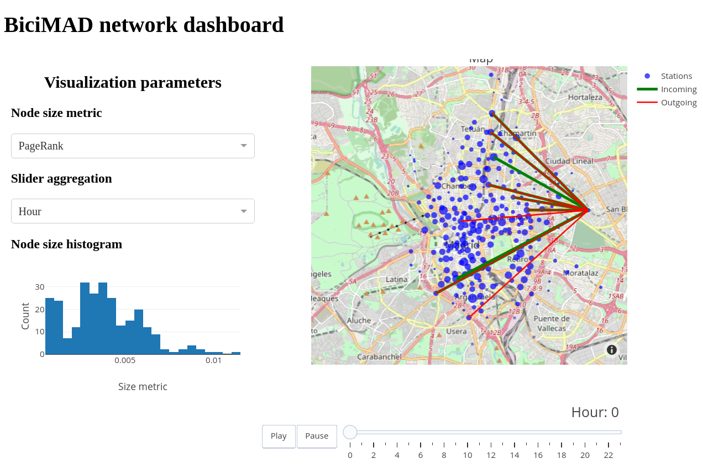

# BiciMAD dashboard

BiciMAD datasest download and analysis code, including an interactive dashboard.



## Usage

Start the database with:

```bash
docker run --name postgres-bicimad -e POSTGRES_PASSWORD={password} -d --restart always --network bicimad -v bicimad-db:/var/lib/postgresql/data postgres
```

Then, build the Jupyter Docker image with:

```bash
docker build -t jupyter-bicimad .
```

And run it with:

```bash
docker run -it -v $(pwd):/home/jovyan/bicimad jupyter-bicimad
```

Alternatively, you can use the prebuilt image available at [DockerHub](https://hub.docker.com/repository/docker/cgupm/bicimad_dashboard).

To get the data and populate the database, run `get_data.ipynb`.
